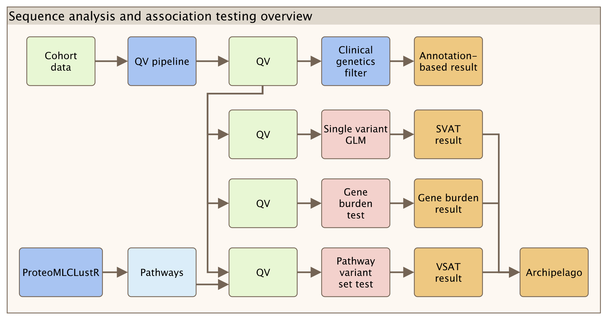
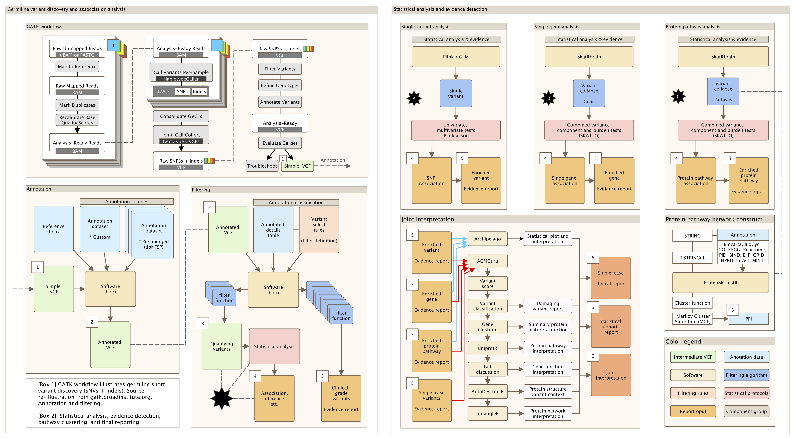
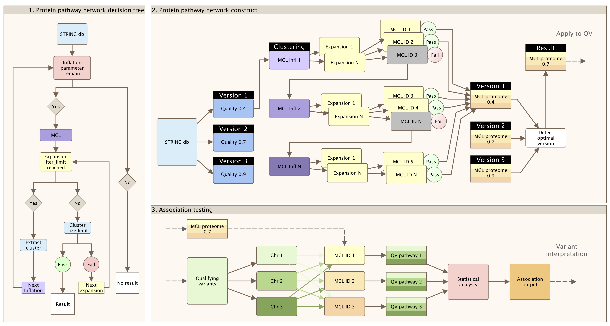

# SPSS vsat

Rare variants in infection response protein pathway associated with sepsis in children.

<!--  -->
<div style="display: flex; justify-content: space-between;">
  
</div>

# Introduction
Welcome to the repository for our project on analyzing rare variants in infection response protein pathways associated with sepsis in children. 
This repository contains all the code, data, and resources used in "Rare variants in infection response protein pathway associated with sepsis in children".

Our project explores the genetic underpinnings of immune response in pediatric sepsis, employing a combination of novel computational tools and in-depth statistical analysis. 
These tools include ProteoMCLustR for protein pathway clustering, SkatRbrain and Archipelago for advanced statistical analyses, and ACMGuru, untangleR, and AutoDestructR for clinical genetics interpretation.

In this repository, you will find structured directories containing R scripts and source code that demonstrate our workflow from data preparation through to variant analysis and interpretation. 
Each tool and method used in our study is documented in detail to aid reproducibility and further research in this critical area of pediatric healthcare.

Contributions and insights from readers are highly encouraged, as we aim to foster a collaborative environment to enhance our understanding of sepsis at the genetic level.

The code in this project is quiet chaotic due to the incremental development. 
We are building a new project with a clean and documented style. 
See <https://swisspedhealth-pipelinedev.github.io/docs/> if you are interested in reading up some of the main content now documented more formally. 

## Publication files

From `sync_publication.sh`
All output files used for publication are listed in the two files `sync_list_figure` and `sync_list_table`.
This study uses git to track code but the data dir is in gitignore due to privacy.
This study contains many unused outputs such as figures (>1500) and numerous intermediate tables.
Therefore, we only need to sync the selected content for a neat publication directory.

## Analysis overview

<div style="display: flex; justify-content: space-between;">
  
</div>
Figure: Simplified overview of full analysis.

## Analysis order of steps
<div style="display: flex; justify-content: space-between;">
  
</div>
Figure: Complete overview of full analysis modules.

## Protein pathway clustering
A critical step in full genomics profiling is the interpretation of variant effect at the higher biological level,within a protein network. 
Since a rare variant effect might be observed in a single patient, we must collapse variants into their protein pathways to observe the association signal across all patients with a shared phenotype.
To achieve this, we made **proteo**me clustering with **MCL** algorithm in **R** (ProteoMCLustR).
We have designed the proteomclustr method to allow unbiased testing withing protein pathways. 
It combines the Markov Cluster Algorithm (MCL), a protein-protein interaction (PPI) database (such as STRINGdb), and customizable parameters tailored to the biological scenario (e.g., PPI evidence score and biological pathway size limits). 
The ProteoMCLustR approach constructs whole-genome protein pathways based on an external database, enabling a comprehensive understanding of biological networks while considering their complexity and specificity. The algorithm is less prone to bias during subsequent statistical analysis, as it performs network clustering independently of the test data.

<div style="display: flex; justify-content: space-between;">
  
</div>
Figure: Summary of the algorithm implemented by [ProteoMCLustR](https://github.com/DylanLawless/ProteoMCLustR) for PPI clustering.

# Script order
1. Data preperation
    - joint_pca
    - ppi
    - ProteoMCLustR_github_clone
2. VSAT
    - variant_level/
    - gene_level/
3. Interpretation
    - ACMGuru_singlecase
        - ACMGuru_singlecase_vcurrent.R
        - requires: stand_alone_vcf_to_table
        - ACMGuru_gene_illustrate_vcurrent.R
        - ACMGuru_gene_illustrate_protein_structure_vcurrent.R
        - ACMGuru_gene_uniprotR.R
    - ACMGuru_post_ppi
        - ACMGuru_post_ppi_vcurrent.R
        - requires: stand_alone_vcf_to_table
        - ACMGuru_gene_illustrate_vcurrent.R
        - ACMGuru_gene_illustrate_protein_structure_vcurrent.R
        - ACMGuru_gene_uniprotR.R
    - archipelago
    - untangleR


# Directory Structure and File Descriptions

```
src/
├── ACMG_filters
├── ACMGuru_post_ppi
├── ACMGuru_singlecase
├── ProteoMCLustR_github_clone
├── archipelago
├── archive
├── cohort_summary_curated
├── document.sh
├── joint_pca
├── post_ppi
├── preprocessing
├── session_info.txt
├── stand_alone_vcf_to_table
├── sync_list_figure
├── sync_list_table
├── sync_list_table_raw
├── sync_publication.sh
├── tables_ID_Mapping.R
├── untangleR
└── variant_level
```

### Inputs
- **Chromosome-split gVCF Files**: These are the primary inputs, processed using GATK and annotated with Ensembl VEP and other annotation databases to ensure comprehensive genetic data analysis.

### Outputs
- **Results Tables**: Detailed tables containing interpreted genetic variants along with their clinical significance.
- **Visualisations**: Graphical representations of the analysis, providing insights into the pathogenicity of the variants.

### Usage
- To perform a full variant analysis, run the `ACMGuru_singlecase_vcurrent.R` script, which orchestrates the variant interpretation using ACMG guidelines, outputting potential pathogenic variants and detailed visualizations.
- Use `sync.sh` to ensure all necessary data files are present and up to date before starting your analysis.

### Script Descriptions
The project directory contains several R scripts and directories, each dedicated to specific tasks or components of the project. The main directories include scripts for post-processing, handling single cases, summarizing cohorts, and converting VCF files to tables. Here's a breakdown:

- **ACMGuru_singlecase**: Manages scripts specific to single-case level variant interpretation.
  - `ACMGuru_singlecase_vcurrent.R`: Script for analyzing single case studies, applying ACMG guidelines to genetic variants, and incorporating custom scripts for converting VCF files to more usable table formats. Requires `stand_alone_vcf_to_table` to import VCFs which were produced from GATK pipeline and ensembl VEP annotation.
  - `sync.sh`: A shell script to synchronize project data with a remote server using rsync.

- **ACMGuru_post_ppi**: Contains scripts for cohort-level variant interpretation which was output from joint analysis of association testing within pathway networks. Requires `stand_alone_vcf_to_table` to import VCFs which were produced from GATK pipeline and ensembl VEP annotation.
  - `ACMGuru_post_ppi_vcurrent.R`: Handles variant data post-protein interaction analysis, integrating several bioinformatics resources and libraries such as dplyr, tidyr, and ggplot2 for data manipulation and visualization.

- **stand_alone_vcf_to_table**: Contains scripts for converting VCF files into table formats, simplifying the analysis of genetic variants. The scripts together act as a pipeline to process VCF files, extract and clean genotype data, and display progress.
	- **stand_alone_vcf_to_table.R**: Coordinates the conversion of VCF files from initial read to final table output, ensuring all components function seamlessly.
	- **gather.R** and **vcf_to_tables.R**: These scripts are part of a pipeline within the `stand_alone_vcf_to_table` directory that processes VCF files, extracting relevant genetic information and structuring it into a usable format for further analysis.
	- **genotype_clean.R**: Cleans and normalizes genotype information to ensure consistency across datasets, which is critical for accurate variant interpretation.
	- **progress_bar.R**: Provides a visual indicator of progress when processing large genetic datasets, enhancing user experience during long-running operations.
- **stand_alone_vcf_to_table order**:
    - for every VCF:
        - source("gather.R")
            - source("vcf_to_tables.R")
        - source("genotype_clean.R")
        - source("progress_bar.R")
    - merge results into single dataframe.

- **cohort_summary_curated**: Scripts for summarizing cohort data in a curated format.
  - `cohort_summary_post_ppi_vcurrent.R`, `cohort_summary_post_singlecase_vcurrent.R`, `cohort_summary_vcurrent.R`: These scripts summarize different aspects of cohort data post-analysis, applying statistical summaries and data visualization.
  - `sync.sh`: Synchronizes the latest sample list and other data from a remote location.

The root directory contains:
- `directory_structure.txt`: Lists the directory structure for documentation purposes.
- `document.sh`: Shell script that generates the directory structure and embeds it into a documentation file, along with the content of R and shell scripts found throughout the project.

### Script Details

#### `ACMGuru_post_ppi_vcurrent.R`
- **Purpose**: This script performs post-protein interaction analysis for genetic variants, including reading VCF files, applying ACMG standards to assess variant pathogenicity, and visualizing results.
- **Key Operations**:
  - Load necessary libraries like `dplyr`, `ggplot2`.
  - Read and manipulate genetic data.
  - Implement complex genetic variant filtering logic based on ACMG guidelines.
  - Generate comprehensive plots to visualize the distribution and impact of genetic variants.

#### `ACMGuru_singlecase_vcurrent.R`
- **Purpose**: Analyzes genetic data from single case studies, applying various bioinformatics techniques to assess the impact of genetic variants.
- **Key Operations**:
  - Incorporate data from external bioinformatics resources.
  - Filter and annotate genetic variants.
  - Visualize data through various ggplot2 plots.
  - Output results in formats suitable for publication or further analysis.

#### `cohort_summary_curated/cohort_summary_vcurrent.R`
- **Purpose**: Summarizes genetic data from cohorts, integrating clinical and phenotypic data to enhance the understanding of genetic impacts on populations.
- **Key Operations**:
  - Merge multiple data sources.
  - Apply statistical methods to summarize data.
  - Produce detailed plots and tables summarizing cohort characteristics.

#### `stand_alone_vcf_to_table/stand_alone_vcf_to_table.R`
- **Purpose**: Converts VCF files into table formats, facilitating easier data manipulation and analysis. Reduces memory and time requirements for processing large VCF sets in R.
- **Key Operations**:
  - Read VCF files using `VariantAnnotation` library.
  - Clean and transform genotype information.
  - Output data in a structured table format.

### Usage

To utilise these scripts, you should have R installed on your system along with the required libraries. Each script can be run independently, depending on the specific needs of the analysis. Data paths and specific parameters should be adjusted in the scripts according to your dataset and analysis requirements.


