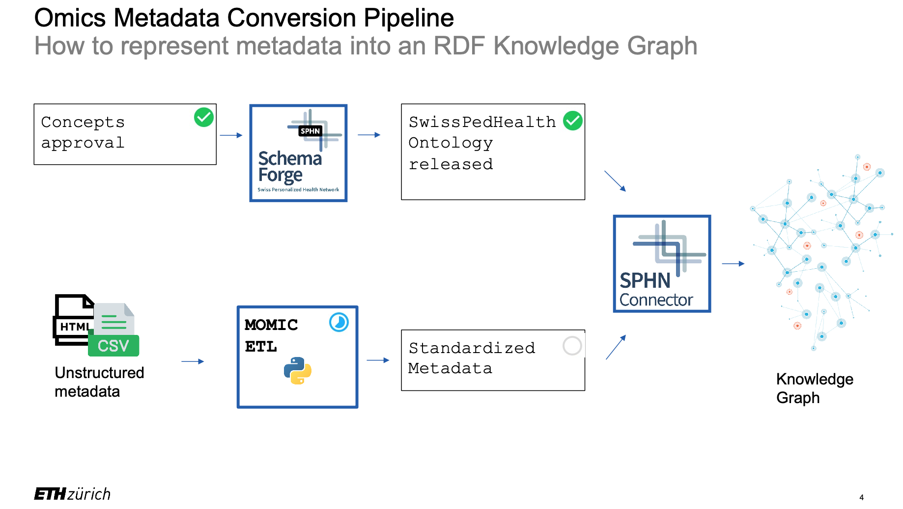

# ACMGuru to SPH 
The current SPH project-specific schema (SPH Schema) was sourced from 

`SPHN NDS and DEM Projects / SwissPedHealth / rdf-schema / Repository`

<https://git.dcc.sib.swiss/project-space/swisspedhealth/rdf-schema/-/blob/main/version-1/dataset/SPH-2024-1-dataset.xlsx?ref_type=heads>

In this repository we have a set of folders containing the following information:

* dataset: Excel file of the project-specific schema (SPH Schema) and the documents describing the concepts.
* schema: Turtle (.ttl) file of the SPH Schema.
* shacl: SHACL rules obtained with SchemaForge.
* sparql: SPARQL queries obtained with SchemaForge.
* doc: HTML for the website documentation of the schema.

The SPH Schema incorporates a few new concepts with respect to the SPHN Schema based on the SPHN Dataset 2024.2, but the project-specific concepts inherit some properties from the reused ones.

## Plan 

{height=30%}

The workflow oder will be:

1. Concept approval 
2. Schema forge
3. SPH ontologies
4. Unstructured metadata: `format_with_metadata`
5. MOMIC ETL 
6. Standardised metadata
7. SPHN connector
8. Knownledge graph

* `1 --> 2 --> 3 `
* `|-------------| --> 7 --> 8 `
* `4 --> 5 --> 6 `

## Sample ID

When we derive "sample", we should do this from:

1. orignal data input source (fastq files): `fastq_sample_id`
2. final result output from ACMGuru: `acmguru_sample_id`
3. then we check that both still match: `fastq_sample_id == acmguru_sample_id`
4. print the final checked "sample" id: `sample_id to format_with_metadata`

* `1 --> 3`
* `| -----| 3 --> 4`
* `2 --> 3`

## Genetic variation

